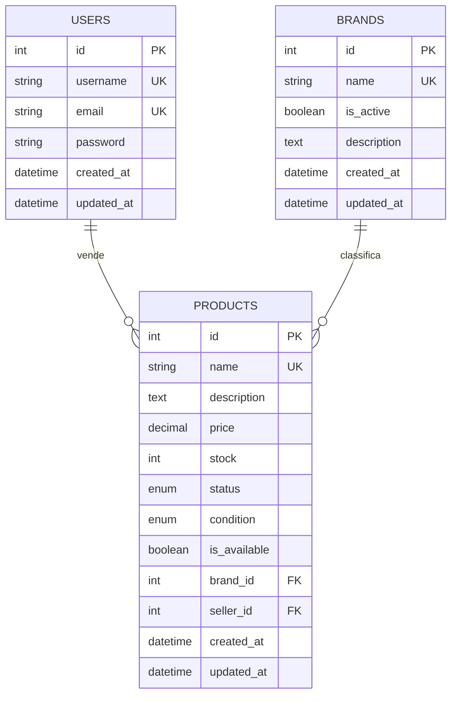
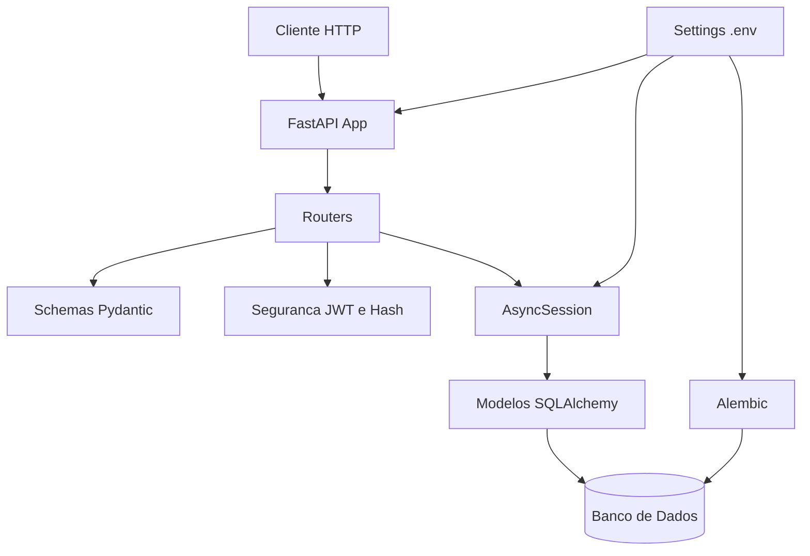
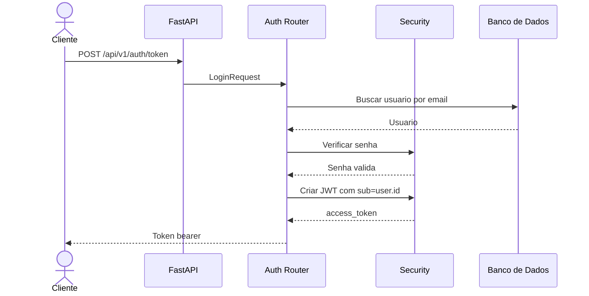
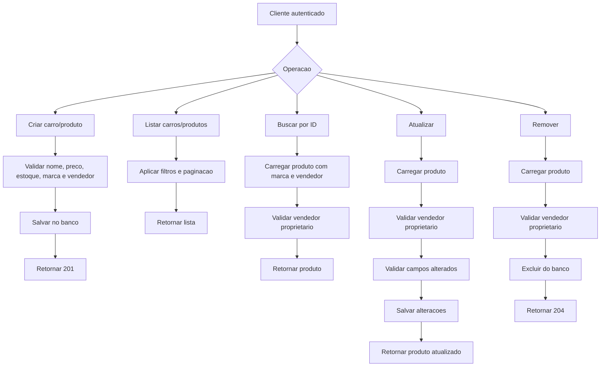
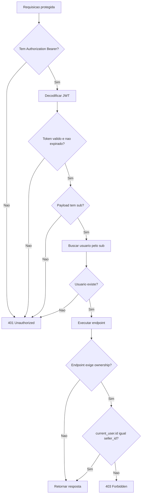

# Modelagem do Sistema

## Modelos de Dados

## Arquitetura do Sistema

## Fluxo de Autenticação

## Fluxo CRUD de Carros

No código atual, o recurso implementado é `Product`. Para o domínio de carros, cada produto pode representar um carro.

## Fluxo de Segurança

